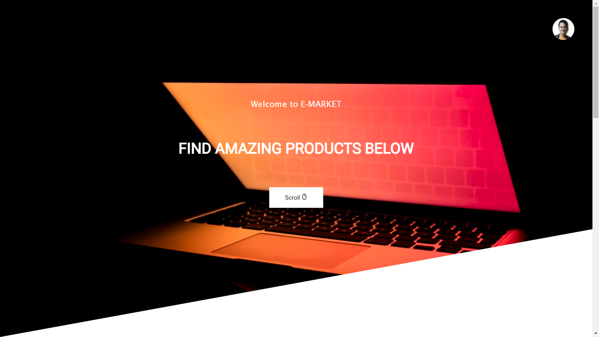

# E-MARKET MERN WEBSITE
This is a sample e-Commerce Website build by Abishank Nayak. The
Frontend is made using ReactJs, Redux for API Calling, Material-UI
Icons and Templates. In the Backend part NodeJs and ExpressJs is
been used. For the DataBase Part MonogoDB is been used. The Images
are stored in Cloudinary.

In this website the **admin** can create, delete and update any products, orders, and users in the **dashboard**.

Using **cloudinary** the images of the products are stored as url links.

Using **@material-ui**, **@material-ui/icons**, and **@material-ui-lab** many layouts are build.

Using **nodemailer** the user get mail while singup and reseting password.


## Link of the Website
[click here to check the website](https://e-market-web-app.herokuapp.com/)


## Screenshots




## Run The Project

Setup:

```bash
    run npm i && npm run dev && cd ./frontend npm run start 